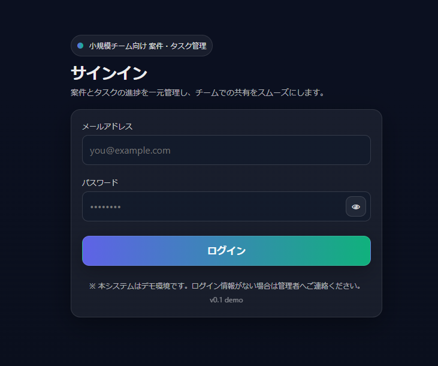
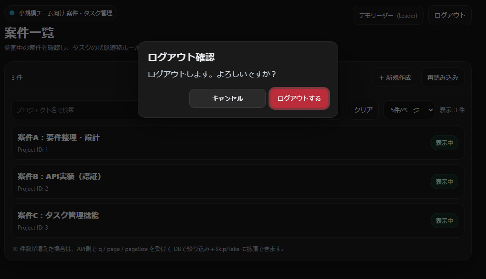
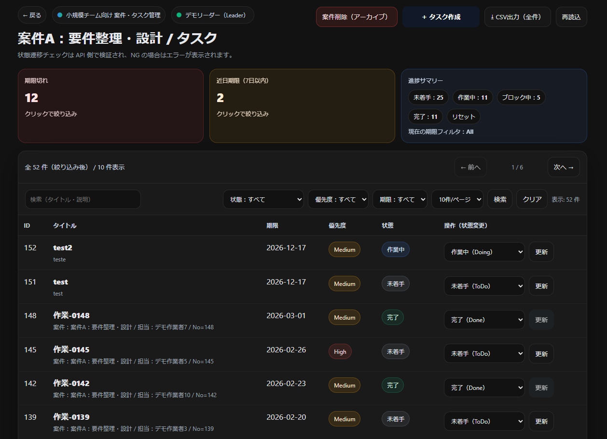
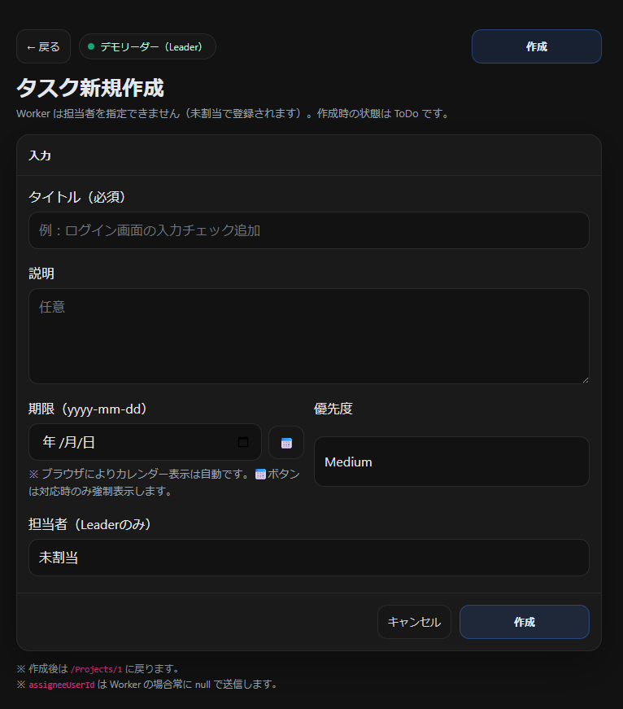
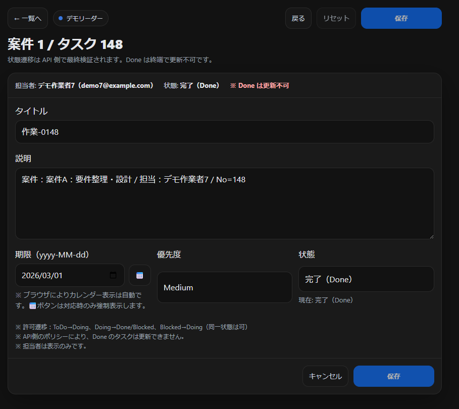
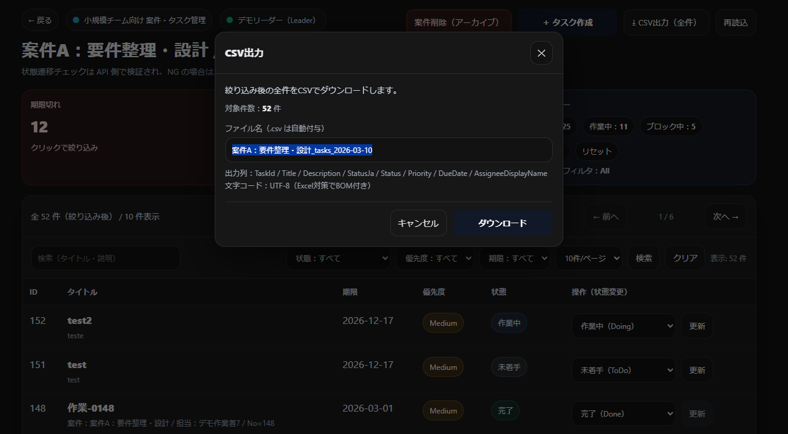

# Task Status Transition Validation – Razor UI


GitHub Actions により、push / pull request 時に  
ビルドおよびテストが自動実行されます。

小規模チーム向けの **案件・タスク管理 Webアプリ（Razor Pages版）** です。  

案件単位でタスクを管理し、  
**タスク状態遷移ルールをサーバー側で検証**することで、  
進捗が形骸化しにくいタスク管理を目的としています。

このリポジトリは **ASP.NET Core Razor Pages を用いた画面実装（UI層）** です。  
バックエンド API と連携して動作します。

---

# 🔗 Related Repository

Backend API

[TaskStatusTransitionValidation-API](https://github.com/fewioaghwrao/TaskStatusTransitionValidation-API)

構成

```text
Frontend (Razor Pages)
   │
   │ API通信
   ▼
Backend (ASP.NET Core Web API)
   │
   ▼
Database
```

---

# 🏗 Architecture

本プロジェクトは **UI / API を分離した構成**で実装しています。

Razor Pages は **画面表示とユーザー入力処理**を担当し、  
業務ロジック（状態遷移ルールなど）は **Backend API 側で管理**しています。

```text
Browser
   │
   ▼
Razor Pages UI
   │
   │ HTTP (Fetch / HttpClient)
   ▼
Backend API
   │
   ▼
Database
```

## UI層（Razor Pages）

Razor Pages では以下を担当します。
- 画面レンダリング
- フォーム入力処理
- API呼び出し
- 認証Cookie管理
- エラーハンドリング

主な構成
```bash
Pages
 ├ Login
 ├ Projects
 │   └ Tasks
 └ Errors

Services
 ├ ApiClient
 └ ApiMeProvider

Models
 ├ DTO
 └ ViewModel
```

## API層（Backend）

Backend API では 業務ロジックを管理します。

主な責務
- タスク状態遷移ルール検証
- データ永続化
- 認証・認可
- タスク検索 / フィルタリング
- CSVエクスポート

状態遷移ルール例

```bash
ToDo → Doing
Doing → Done
Doing → Blocked
Blocked → Doing
```
不正な遷移は API側で拒否されます。

## 設計方針
本プロジェクトでは以下の設計方針を採用しています。
- UI と業務ロジックの分離
- API を中心としたアーキテクチャ
- Razor Pages によるシンプルな画面構成
- 業務ルール（状態遷移）のサーバー管理

これにより
- UI変更の影響を最小化
- ビジネスロジックの一元管理
- テスト容易性

を実現しています。
---

# 📌 Features

このアプリでは以下の機能を実装しています。

## 案件管理

- 案件一覧表示  
- 案件検索  
- ページング  
- 案件作成（Leaderのみ）  
- 案件アーカイブ（Leaderのみ）  

---

## タスク管理

- タスク一覧表示  
- タスク新規作成  
- タスク編集  
- タスク状態変更  

状態は以下の遷移ルールを持ちます。

```bash
ToDo → Doing
Doing → Done
Doing → Blocked
Blocked → Doing
```


状態遷移の検証は **API側で実装** されています。

---

## 進捗サマリー

案件画面では以下の情報を表示します。

- 期限切れ件数  
- 近日期限（7日以内）  

状態別タスク数  
- 未着手
- 作業中
- ブロック中
- 完了

---

## CSVエクスポート

絞り込み条件を反映したタスク一覧を  
**CSV形式で一括ダウンロード**できます。

出力仕様
```bash
UTF-8（Excel対応BOM付き）

TaskId
Title
Description
Status
Priority
DueDate
AssigneeDisplayName
CreatedAt
UpdatedAt
```


---

## 権限管理

ユーザーは **Role** を持ちます。

| 機能 | Leader | Worker |
|------|--------|--------|
| 案件作成 | ○ | × |
| 案件アーカイブ | ○ | × |
| タスク作成 | ○ | ○ |
| 担当者指定 | ○ | × |
| 状態変更 | ○ | ○ |
| CSV出力 | ○ | ○ |

---

# 🖥 スクリーンショット

## ログイン



---

## 案件一覧


---

## ログアウト確認



---

## タスク一覧



---

## 新規タスク作成



---

## タスク詳細



---

## CSV出力



---

# 🔁 Page Flow
```bash
Login
↓
Projects
↓
Project Detail (Task List)
↓
Task Create / Task Detail
```

---

# 🛠 技術スタック

## Frontend
- ASP.NET Core Razor Pages
- C#
- HTML / CSS
- Fetch API

## Backend
- ASP.NET Core Web API

## Infrastructure
- クラウド環境 (検証)

---

# 🧪 テスト

本プロジェクトでは Razor Pages の主要画面について  
**統合テスト（Integration Test）** を実装しています。

テストでは以下を検証しています。

- 認証Cookieあり / なしでのアクセス制御
- PageModelの処理結果
- フォームPOST処理
- AntiforgeryTokenの検証
- 画面遷移（Redirect）

例
```bash
GET /Projects
→ 認証あり：200 OK

POST /Logout
→ /Login にリダイレクト
```

## 使用技術
- xUnit
- WebApplicationFactory
- HttpClient
- ASP.NET Core TestHost

---

# 🎯 プロジェクトの目的

このプロジェクトでは以下の実装を目的としています。

- Razor Pages による **業務系画面開発**
- API連携型の **サーバーサイドUI**
- タスク状態遷移ルールの **業務ロジック検証**
- Roleベースの **操作制御**
- CSVエクスポートなど **業務システムの典型機能**

ポートフォリオとして  
**業務Webアプリケーションの設計・実装経験** を示すことを目的としています。

---

# 🚀 今後の改善

今後の拡張案

- タスクコメント機能  
- メンバー招待  
- 操作ログ（監査）  
- 状態遷移ルールのカスタマイズ  
- CI / CD  
- E2Eテスト  

---

# 📄 ライセンス

MIT License

---
